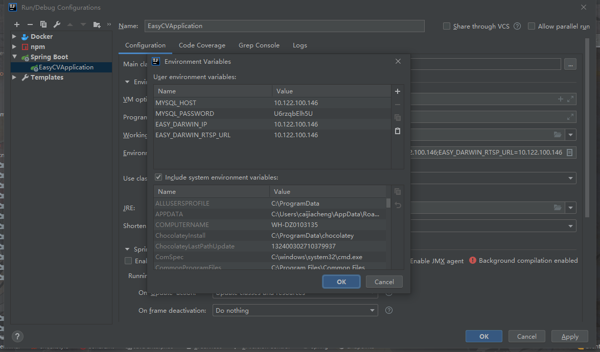
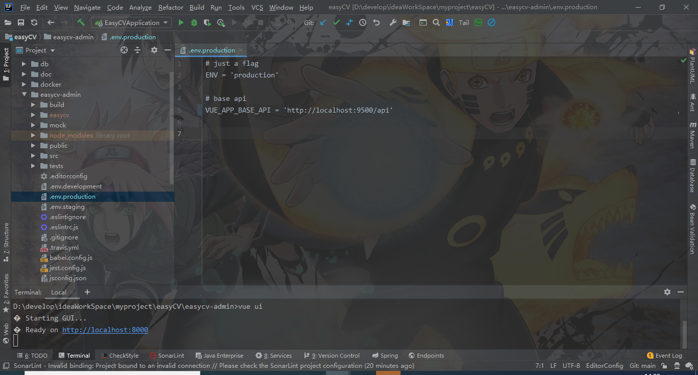
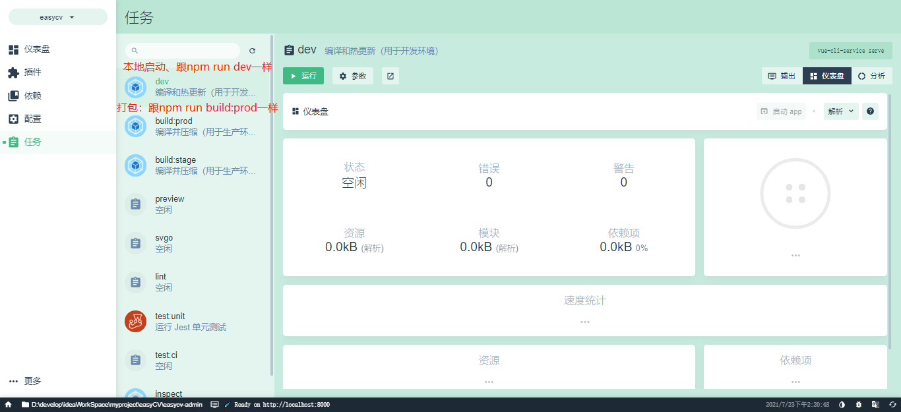
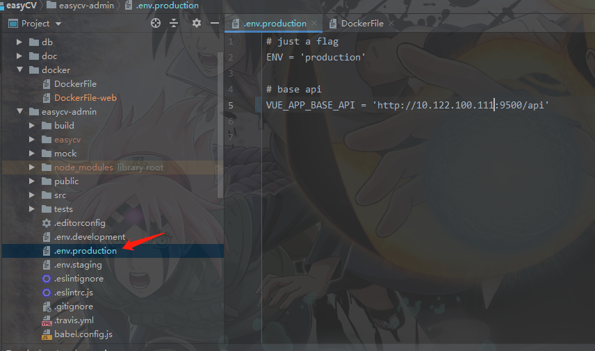
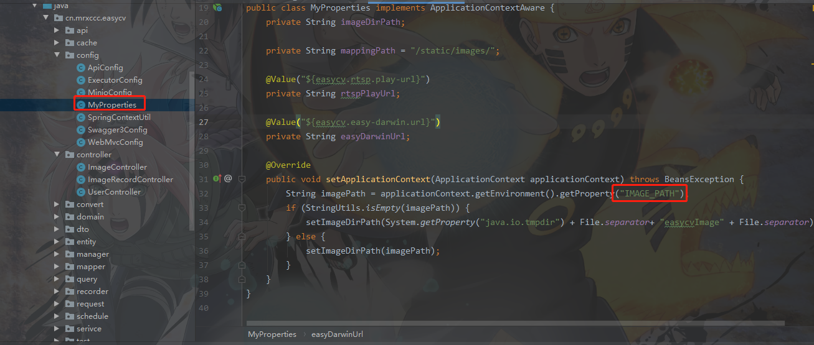
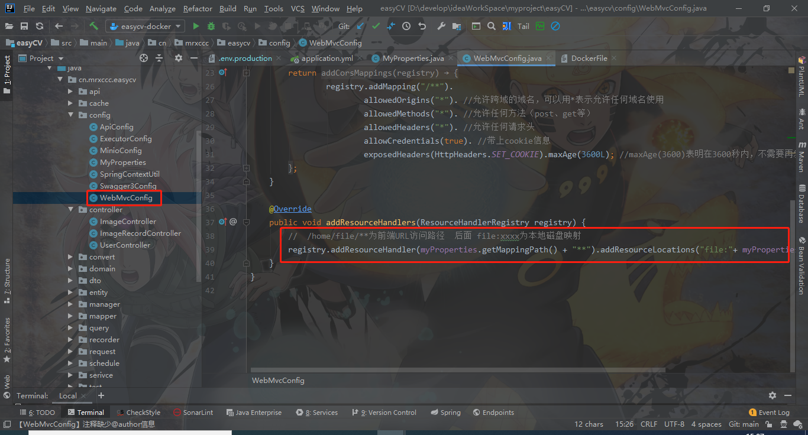

# 项目介绍

本项目旨在解决视频测试环境下模拟稳定流，拷贝的视频文件过大的问题，主要方式采用图片生成一路rtsp流，方便快捷


## 项目结构

分为前端、后端两个工程

* 后端采用Spring Boot + [javacv](https://github.com/bytedeco/javacv/) + [EasyDarwin](https://github.com/EasyDarwin/EasyDarwin)

* 前端采用[vue-element-admin](https://panjiachen.gitee.io/vue-element-admin-site/zh/)作为模板进行二次开发

本文主要介绍该项目中如何进行前后端部署、打包、及前后端二次开发


## 视频流传输流程

本地图片->   Javacv处理   ->   EasyDarwin   ->  拉取视频

EasyDarwin是一个开源的流媒体服务器，支持功能丰富：

- 支持RTSP推流分发（推模式转发）；
- 支持RTSP拉流分发（拉模式转发）；
- 服务端录像 参考:https://blog.csdn.net/jyt0551/article/details/84189498
- 服务端录像检索与回放 参考:https://blog.csdn.net/jyt0551/article/details/84189498
- 关键帧缓存；
- 秒开画面；
- Web后台管理；
- 分布式负载均衡；

本项目主要用到EasyDarwin的`RTSP推流分发`功能

## 1.后端部署及打包

后端服务依赖mariadb、EasyDarwin两个服务，所以事先安装好mariadb和EasyDarwin

mariadb的安装就不介绍了，有很多教程，可以下载源码或者docker进行安装

### 1.1数据库表的初始化

这里主要介绍后端依赖的数据库表，执行本段代码到数据库中即可

```
CREATE DATABASE IF NOT EXISTS easycv;
use easycv;

SET NAMES utf8mb4;
SET FOREIGN_KEY_CHECKS = 0;

-- ----------------------------
-- Table structure for img
-- ----------------------------
DROP TABLE IF EXISTS `img`;
CREATE TABLE `img`  (
  `id` int(11) NOT NULL AUTO_INCREMENT COMMENT '主键id',
  `img_name` varchar(255) CHARACTER SET utf8mb4 COLLATE utf8mb4_unicode_ci NOT NULL COMMENT '图片名称',
  `img_path` varchar(255) CHARACTER SET utf8mb4 COLLATE utf8mb4_unicode_ci NOT NULL COMMENT '图片路径',
  `create_time` datetime(0) NOT NULL COMMENT '创建日期',
  `update_time` datetime(0) NOT NULL COMMENT '修改日期',
  PRIMARY KEY (`id`) USING BTREE
) ENGINE = InnoDB AUTO_INCREMENT = 1 CHARACTER SET = utf8mb4 COLLATE = utf8mb4_unicode_ci ROW_FORMAT = Dynamic;

-- ----------------------------
-- Table structure for img_record_task
-- ----------------------------
DROP TABLE IF EXISTS `img_record_task`;
CREATE TABLE `img_record_task`  (
  `id` bigint(255) NOT NULL AUTO_INCREMENT COMMENT '主键',
  `image_id` varchar(255) CHARACTER SET utf8mb4 COLLATE utf8mb4_unicode_ci NOT NULL COMMENT '图片id',
  `status` varchar(255) CHARACTER SET utf8mb4 COLLATE utf8mb4_unicode_ci NOT NULL COMMENT '状态',
  `play_url` varchar(255) CHARACTER SET utf8mb4 COLLATE utf8mb4_unicode_ci NOT NULL COMMENT '播放地址',
  `create_time` datetime(0) NOT NULL COMMENT '创建时间',
  `update_time` datetime(0) NOT NULL COMMENT '更新时间',
  `end_time` datetime(0) NULL DEFAULT NULL COMMENT '任务结束时间',
  PRIMARY KEY (`id`) USING BTREE
) ENGINE = InnoDB AUTO_INCREMENT = 8 CHARACTER SET = utf8mb4 COLLATE = utf8mb4_unicode_ci ROW_FORMAT = Dynamic;

SET FOREIGN_KEY_CHECKS = 1;

```

主要就是两张表：一张`img`图片信息表，一张`img_record_task`图片录像任务表

### 1.2EasyDarwin的安装部署

- [下载解压 release 包](https://github.com/EasyDarwin/EasyDarwin/releases)

- 直接运行(Windows)

  EasyDarwin.exe

  以 `Ctrl + C` 停止服务

- 以服务启动(Windows)

  ServiceInstall-EasyDarwin.exe

  以 ServiceUninstall-EasyDarwin.exe 卸载 EasyDarwin 服务

- 直接运行(Linux/macOS)

  ```
    cd EasyDarwin
    ./easydarwin
    # Ctrl + C
  ```

- 以服务启动(Linux/macOS)

  ```
    cd EasyDarwin
    ./start.sh
    # ./stop.sh
  ```

- 查看界面

  打开浏览器输入 [http://localhost:10008](http://localhost:10008/), 进入控制页面,默认用户名密码是admin/admin

## 2 本地启动前后端服务

### 2.1本地启动后端服务

下载安装完mariadb、初始化数据库、安装EasyDarwin后，就可以开始在本地启动后端服务了

在idea中，设置如下环境变量：



> MYSQL_HOST=10.122.100.146; // mariadb的地址
> MYSQL_PASSWORD=U6rzqbElh5U;// mariadb的密码，用户名如果默认是root，可以不配置
> EASY_DARWIN_IP=10.122.100.146; // EasyDarwin的ip地址
> EASY_DARWIN_RTSP_URL=10.122.100.146 // 视频流转推地址，也就是rtsp中url带的地址，和EasyDarwin保持一直即可

配置完以上环境变量，然后就可以启动服务了

### 2.2本地启动前端服务页面

vue-element-admin是基于vue-cli4搭建的脚手架二次封装的开发模板，启动方式还是node得那一套方式

首先要修改访问后端的接口地址的**前缀**：

也就是后端服务部署在哪里，ip就填部署的机器的ip，dev环境变量默认的接口地址是：http://localhost:9500/api



不过有两种方式：命令方式、`vue ui`方式

**命令方式**

启动服务：进入项目中得`easycv-admin`目录，执行`npm run dev`命令即可

启动完成访问`http://localhost:9528`即可访问页面

**vue ui**

vue ui是vue-cli4的新功能，在vue项目目录下面，执行`vue ui` 会在本地启动一个项目插件、依赖、配置以及任务的管理界面，可视化的对项目的进行管理，启动后的地址为：http://localhost:8000/

在这个页面对项目进行可视化的配置及应用的启动

## 3.打包

### 3.1 后端springboot打包

springboot打包依赖docker，dockerfile如下：

```
FROM adoptopenjdk/openjdk8:alpine-slim
ENV TZ Asia/Shanghai
ENV BASE_PATH='/opt' \
    PRO_PATH='/opt/project'
WORKDIR $PRO_PATH
ADD target/easyCV-1.0.0-SNAPSHOT-exec.jar $PRO_PATH
ENV IMAGE_PATH='/data/image'
VOLUME ["/data/image"]
EXPOSE 9500

ENTRYPOINT ["java","-jar","easyCV-1.0.0-SNAPSHOT-exec.jar"]

```

打包命令：`docker build -f DockerFile -t ampregistry:5000/easycv-2021071161652:v1.0 .`

构建容器命令：

```
docker run -p 9500:9500 --env MYSQL_HOST=10.122.100.146 --env MYSQL_PASSWORD=U6rzqbElh5U --env EASY_DARWIN_IP=10.122.100.146 --env EASY_DARWIN_RTSP_URL=10.122.100.146 --name easyCV ampregistry:5000/easycv-2021071161652:v1.0 
```

> MYSQL_HOST=10.122.100.146; // mariadb的地址
> MYSQL_PASSWORD=U6rzqbElh5U;// mariadb的密码，用户名如果默认是root，可以不配置
> EASY_DARWIN_IP=10.122.100.146; // EasyDarwin的ip地址
> EASY_DARWIN_RTSP_URL=10.122.100.146 // 视频流转推地址，也就是rtsp中url带的地址，和EasyDarwin保持一直即可

### 3.2 前端静态文件打包

打包前端镜像文件之前，修改服务ip地址，在`easycv-admin`目录本地执行命令：`npm run build:prod`,执行完后生成的easycv文件及为静态文件



 


### 3.3 部署静态文件

部署vue打包后的静态文件有两种方式：

#### 3.3.1与springboot整合

第一种，将`easycv`文件夹拷贝到springboot项目中的`resources`目录,然后启动项目，通过springboot的静态资源文件映射可以通过服务访问页面，不过这种方式缺点是改动前端页面时，要同时打包后端jar包文件，比较麻烦

访问路径是：http://localhost:9500/easycv/index.html

#### 3.3.2 nginx代理及跨域配置

第二种，通过nginx代理，将静态资源文件映射到某个端口进行访问，这种方式比较常用，提供一个nginx的比较简单配置(包含跨域配置)，将`easycv`拷贝到`/usr/share/nginx/wwwroot`目录，访问http://ip/easycv就可以看到页面(ip是nginx的ip地址)

```
worker_processes  1;

events {
    worker_connections  1024;
}

http {
    include       mime.types;
    default_type  application/octet-stream;
    sendfile        on;
    keepalive_timeout  65;
    charset utf-8;        # 设置编码格式

    proxy_set_header X-Forwarded-Host $host;
    proxy_set_header X-Forwarded-Server $host;
    proxy_set_header X-Forwarded-For $proxy_add_x_forwarded_for;
    server {
      listen 80;             # 端口号
      server_name 172.20.44.189;           # 配置域名信息

      add_header Access-Control-Allow-Credentials true;
      add_header Access-Control-Allow-Origin $http_origin;
      location /{
        root /usr/share/nginx/wwwroot;               # 静态页面根目录
        index index.html;
      }
      location /api {
        proxy_pass http://172.20.44.189:9500/api; # 后台 API 地址
      }
        add_header Access-Control-Allow-Origin "*" always;
        add_header Access-Control-Allow-Methods GET,POST,PUT,DELETE,OPTIONS always;
        add_header Access-Control-Allow-Credentials true always;
        add_header Access-Control-Allow-Headers DNT,X-CustomHeader,Keep-Alive,User-Agent,X-Requested-With,If-Modified-Since,Cache-Control,Content-Type,Authorization,x-auth-token always;
        add_header Access-Control-Max-Age 1728000 always;

        # 预检请求处理
        if ($request_method = OPTIONS) {
                return 204;
        }
    }
}
```

## 4.后端服务关键配置说明

### 图片存储地址

后端存储的图片是上传到服务所在机器指定文件，然后通过spring的静态资源文件映射实现的，所以想修改存储文件的地址，修改变量“IMAGE_PATH”，如果没有配置，默认存储在`System.getProperty("java.io.tmpdir") + File.separator+ "easycvImage" + File.separator`目录下。

如果是使用docker启动容器，那么默认地址为`/data/image`，因为`Dockerfile`是有配置该变量的：`ENV IMAGE_PATH='/data/image'`





### 线程池核心线程数：

每一路rtsp视频流都是用的一个线程执行的，使用线程池管理的，所以想要扩展服务中rtsp流的路数，需要修改线程池的核心线程数

SpringBoot的application.yml

```
# 异步线程配置
# 核心线程数
async:
  executor:
    thread:
      name:
        prefix: image-record-   # 线程池中线程的名称前缀
      core_pool_size: 20  # 核心线程数
      max_pool_size: 50     # 最大线程数
      queue_capacity: 50  # 任务队列大小
      keep_alive_seconds: 100   # 缓冲队列中线程的空闲时间
```

